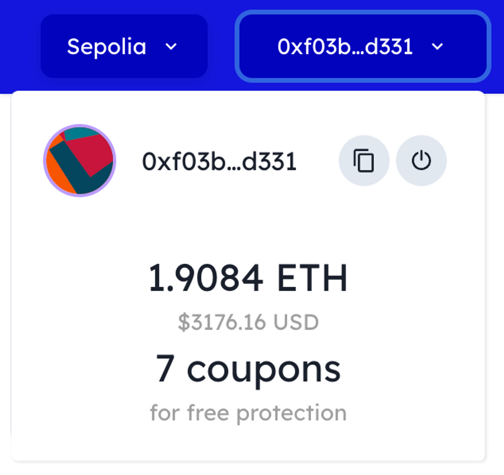
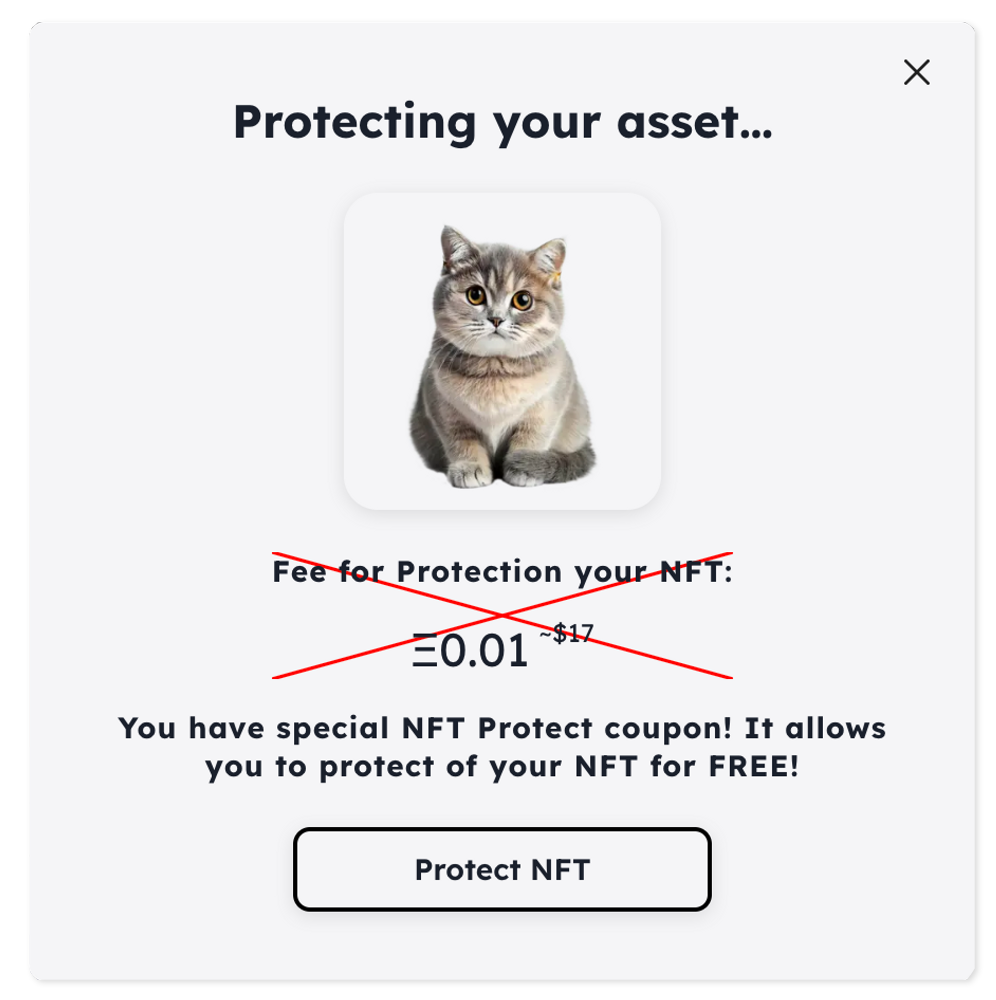

# Coupons Guide

The NFT Protect protocol offers a unique way to safeguard your digital assets. While users typically pay a protocol fee for this service, there's also an option to protect your NFTs for free using a special coupon. These coupons are represented by ERC-20 tokens named NFTP. It will be automatically deducted when you opt to protect a digital asset with an NFTP token in your wallet. However, please note that you'll still need to cover the network's gas fee.

To check the number of available coupons you have, simply expand the wallet information section within the app interface. Remember, one coupon equates to one free protection.

<figure><figcaption></figcaption></figure>

If you possess a coupon, it will be automatically used once you click the "Protect NFT" button.

<figure><figcaption></figcaption></figure>

You can earn these coupons by participating in our quests on [Galxe](https://galxe.com/nftprotect) or by contributing to protocol improvements in our [Discord](https://go.nftprotect.app/discord) community or via [Dework](https://go.nftprotect.app/dework).

_**Note:** NFTP tokens are not intended for secondary trading. They cannot be purchased on the open market but can only be earned through various activities within the protocol. The project team has no intention of selling these coupons for an additional fee._
