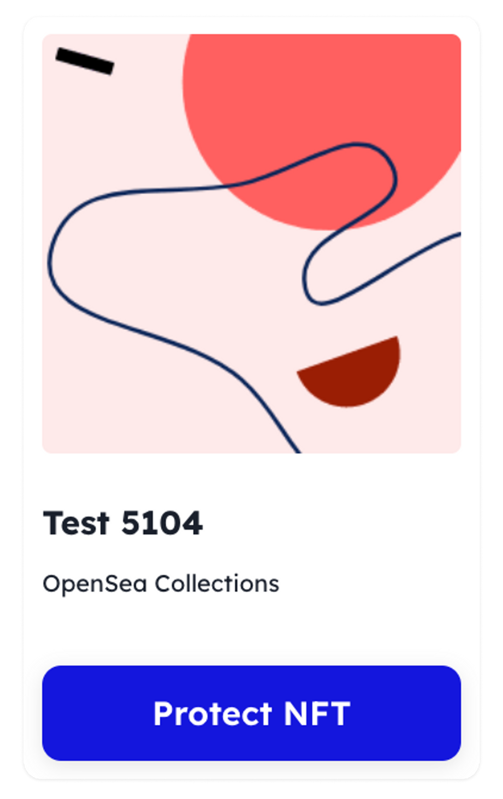
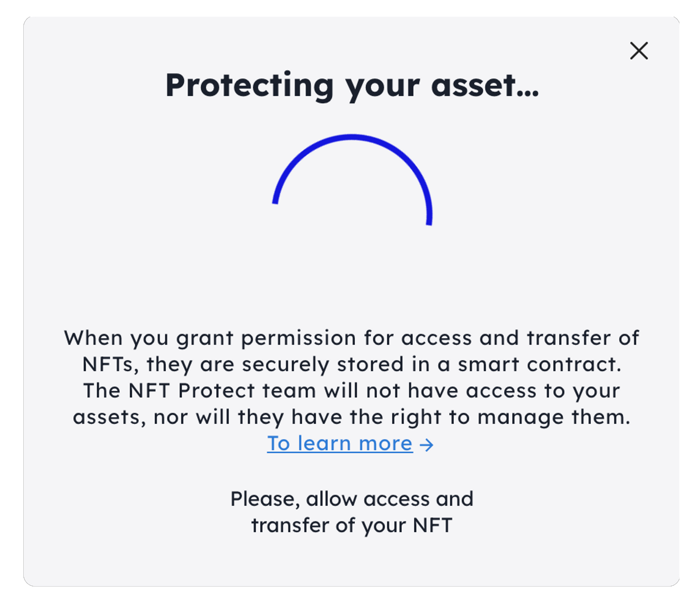
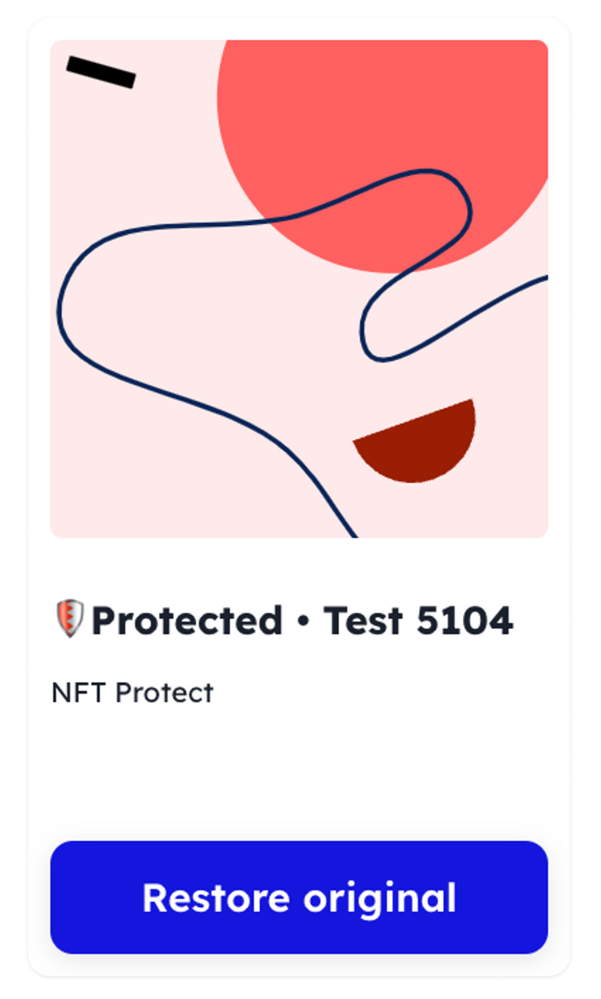
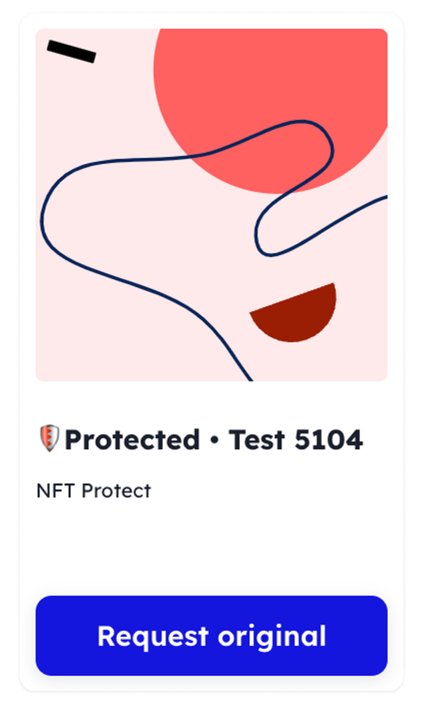
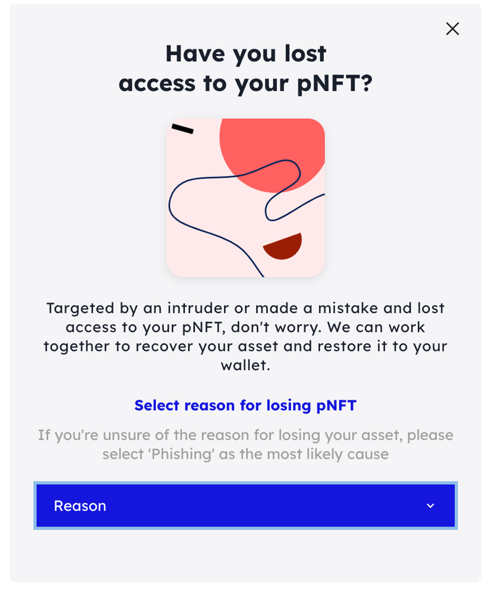

---
layout:
  title:
    visible: true
  description:
    visible: false
  tableOfContents:
    visible: true
  outline:
    visible: true
  pagination:
    visible: true
---

# Testnet Guidelines

## **Contents**

[#preliminary-stage](testnet-guidelines.md#preliminary-stage "mention")

[#getting-started](testnet-guidelines.md#getting-started "mention")

[#protecting-your-nft](testnet-guidelines.md#protecting-your-nft "mention")

[#restoring-the-original-nft](testnet-guidelines.md#restoring-the-original-nft "mention")

[#transferring-the-original-nft](testnet-guidelines.md#transferring-the-original-nft "mention")

[#requesting-the-original-nft](testnet-guidelines.md#requesting-the-original-nft "mention")

[#opening-a-dispute-in-the-decentralized-court](testnet-guidelines.md#opening-a-dispute-in-the-decentralized-court "mention")

[#switching-the-dispute-stage-in-kleros](testnet-guidelines.md#switching-the-dispute-stage-in-kleros "mention")

## **Preliminary Stage**

The application is launched on the Goerli and Sepolia testnets. You'll need NFTs and tokens from one of these networks to interact with the application.

### **Resources to Assist You:**

* **Goerli Faucet**: [https://goerlifaucet.com](https://goerlifaucet.com/) (0.2 test ETH per day)
* **Sepolia Faucets**: [https://faucetlink.to/sepolia](https://faucetlink.to/sepolia)
* **Purchase Goerli NFTs on**:
  * [https://www.testnetmint.com](https://www.testnetmint.com/)
  * [https://testnets.opensea.io](https://testnets.opensea.io/)
  * [https://testnet.rarible.com](https://testnet.rarible.com/)
* **Purchase Sepolia NFTs on**: [https://testnets.opensea.io/collection/nftprotect-ciphervisage/drop](https://testnets.opensea.io/collection/nftprotect-ciphervisage/drop)

## **Getting Started**

1. Visit the application page at [https://dev.nftprotect.app/](https://dev.nftprotect.app/?utm\_source=doc\&utm\_medium=link\&utm\_campaign=testnet\_guide)
2. **Connecting a Crypto Wallet:**\
   NFT Protect operates as a Decentralized Application (DApp). To interact with the platform, you'll need a non-custodial Crypto Wallet. This wallet holds your assets, and every transaction initiated by NFT Protect requires your wallet's confirmation for security reasons.
   * Supported Wallets: Metamask and Wallet Connect.
   * Click the "Connect wallet" button.
   * Choose your preferred wallet (Metamask or Wallet Connect) and network (Goerli or Sepolia), then confirm your choice in the wallet.
   * Once connected, the application will display all your owned NFTs.

## **Protecting Your NFT**

Select any NFT and protect it by clicking the **“Protect NFT”** button.

<figure><figcaption></figcaption></figure>

### **Steps to Protect:**

1. Grant the protocol permission to access and protect your NFT in your wallet.&#x20;

<figure><figcaption>
Allow access and transfer of your NFT
</figcaption></figure>

2. Pay the protocol and the gas (or transaction) fees.

The Protected NFT (pNFT) will appear in a new application section titled “All your protected assets.”&#x20;


Remember, you can sell your pNFT on marketplaces, transfer it, or use it in supported protocols.


## **Restoring the Original NFT**

At any time, you can restore your original NFT. In doing so, the pNFT will be burned, and the original NFT will be retrieved from the vault.

<figure><figcaption></figcaption></figure>

### **Steps to Restore:**

* Navigate to the “All your protected assets” section, locate your pNFT, and click on the "**Restore original**" button.&#x20;
* Confirm your intention in the pop-up window, and then confirm and pay for the transaction in your wallet.

## **Transferring the Original NFT**

After selling or transferring the pNFT to a new owner, you can securely transfer the original NFT to them.

### **Steps to Transfer:**

1. Go to the “Transferred pNFT” section,&#x20;
2. Find the pNFT, and&#x20;
3. Click on the "**Transfer original**" button.

<figure><figcaption></figcaption></figure>

4. Confirm your intention in the pop-up window, and then confirm and pay for the transaction in your wallet.

## **Requesting the Original NFT**

If you've acquired a Protected NFT and the original NFT owner hasn't subsequently transferred the original to you, you can request the original, reminding them of the transfer.

### **Steps to Request:**

1. Navigate to the “All your protected assets” section, locate your pNFT
2. Click on the "Request original" button.&#x20;
3. Confirm and pay for the transaction in your wallet.

<figure><figcaption></figcaption></figure>

### **Response Time:**

After sending the request, the original NFT owner has 48 hours to respond. If they confirm the transfer of the original, the original NFT will move to your wallet, and the pNFT will be burned. If the original NFT isn't transferred, you can open a dispute in the Kleros decentralized court. To do this, click on the **“Open Dispute”** button.

## **Opening a Dispute in the Decentralized Court**

In case of any disputes or disagreements, you can seek resolution through the Kleros decentralized court via the NFT Protect application. This might be necessary if, for instance, a pNFT was lost due to a phishing attack, a protocol breach, or an accidental transfer to an incorrect wallet address. Here's how to proceed:

1. **Initiating the Dispute:**
   * Navigate to the digital asset in question within the application.
   * Click on the “Open Dispute” button.
2.  **Reason for Dispute:**

    * In the pop-up window, select the reason for losing the pNFT.&#x20;

    

    <figure><figcaption></figcaption></figure>

    

3. **Submitting Evidence:**
   * In the subsequent window, attach all available evidence supporting your claim. This could include:
     * Chat logs or emails that confirm a phishing attack.
     * Security reports or Protocol Breach Post-mortem if the loss of pNFT resulted from a protocol breach or hack. Check the Policy for the complete list.
   * NFT Protect will also provide additional evidence, such as the pNFT movement history and data about the plaintiff and defendant.
4. **Paying for Arbitration:**
   * Cover the arbitration fees to open the case formally.
5. **Evidence Period:**
   * The case is opened once the fees are paid, and jurors are selected. During this phase, you (or anyone else) can submit additional evidence related to the case.
   * In the mainnet, this phase lasts for a specific duration before automatically moving to the next stage. In the testnet, transitioning from the Evidence Period to the Voting Period must be done manually. (More details in “[Switching the Dispute Stage in Kleros](testnet-guidelines.md#switching-the-dispute-stage-in-kleros)”).
6. **Voting Period:**
   * During this phase, the arbitrators review the case materials and cast their votes.
   * In the mainnet, jurors have a set time to vote, after which the case automatically progresses to the next stage. In the testnet, transitioning from the Voting Period to the Appealing Period must be done manually. (More details in “[Switching the Dispute Stage in Kleros](testnet-guidelines.md#switching-the-dispute-stage-in-kleros)”).
7. **Appealing Period:**
   * Any user disagreeing with the court's decision can file an appeal during this phase.
   * In the mainnet, users have a specific duration to file and pay for an appeal, after which the case automatically moves to the next stage. In the testnet, filing an appeal is not possible. Transitioning from the Appealing Period to the Decision Period must be done manually. (More details in “[Switching the Dispute Stage in Kleros](testnet-guidelines.md#switching-the-dispute-stage-in-kleros)”).
8. **Decision Period:**
   * To enforce the court's ruling, click on the “Enforce the Ruling” button. Before this, in the testnet, you need to make manual adjustments at any time. (More details in “[Switching the Dispute Stage in Kleros](testnet-guidelines.md#switching-the-dispute-stage-in-kleros)”).

## **Switching the Dispute Stage in Kleros**

1. **Accessing the Contract:**\
   Navigate to either:
   * [Goerli Etherscan](https://goerli.etherscan.io/address/0x1128eD55ab2d796fa92D2F8E1f336d745354a77A)
   * [Sepolia Etherscan](https://sepolia.etherscan.io/address/0x90992fb4E15ce0C59aEFfb376460Fda4Ee19C879)
2. **Reading the Contract:**
   * Click on the "read contract" tab.
   * Connect to your wallet using the "connect to web3" option.
   * Check the current value of the `phase` parameter.
3. **Writing to the Contract:**
   * Click on the "write contract" tab.
   * Again, connect to your wallet using the "connect to web3" option.
   * Call the `passPhase` function to change the `phase` value to 2. Depending on the initial status of the phase, you may need to pay for up to 3 transactions.
   * For transitioning to the voting stage, use the `drawJurors` function. Specify the Kleros dispute number in the `_disputeID` field and assign 3 judges in the `_iterations` parameter. Confirm and pay for the transaction.
   * Use the `passPeriod` function, specify the Kleros dispute number, and pay for the transaction.
4. **Verifying the Dispute Stage:**
   * Navigate back to the dispute page either in the NFT Protect interface or on the Kleros website.
   * Ensure that the case has transitioned to the desired stage.
5. **Completing the Dispute:**
   * To finalize the dispute, you need to repeat the above instructions three times to transition the dispute through the following stages:
     1. From the evidence stage to the voting stage.
     2. From the voting stage to the appeal stage.
     3. From the appeal stage to the final decision stage.
6. **Executing the Ruling:**
   * Once all three stages are completed, initiate the `executeRuling` method.
   * Specify the dispute number and confirm the transaction in Metamask.
   * After this, you can click on the “enforce the ruling” button on the dispute page in the NFT Protect interface.

\
