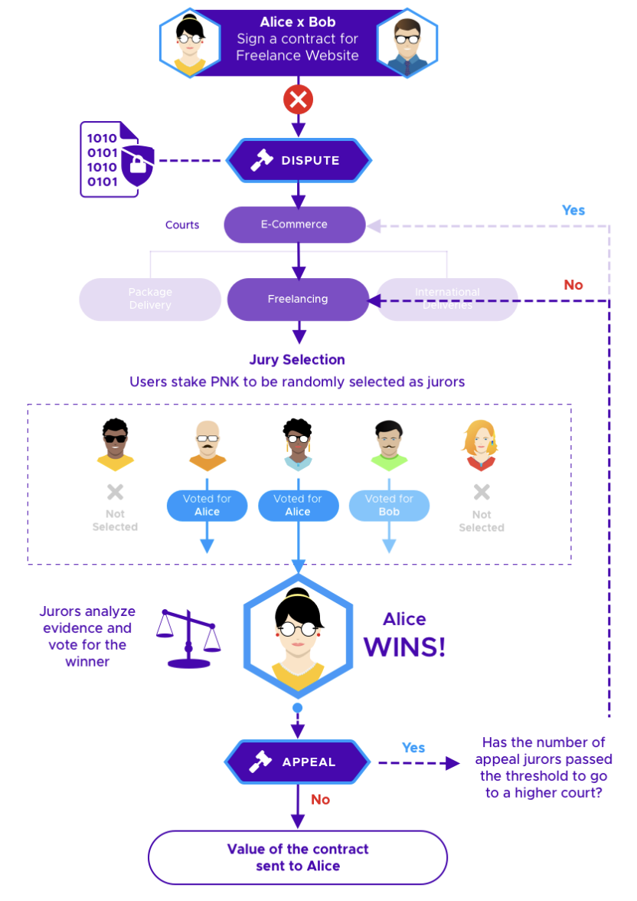

# Dispute Resolution Layer

## What is Kleros?

Kleros is a decentralized dispute resolution protocol for use on smart contract platforms, which has been implemented on Ethereum.



It acts as a decentralized third party capable of providing decisions on the correct result when applying a set of rules to questions ranging from simple to highly complex.

This is achieved by using game-theoretic incentives to have crowdsourced jurors analyze and rule on cases correctly. Hence, Kleros provides judgments in an inexpensive, reliable, typically fast, and decentralized way. Of particular relevance is the use of this protocol to dispute resolution, creating a form of decentralized justice.

<figure><figcaption>
Example of dispute summing up how Kleros works.
</figcaption></figure>
